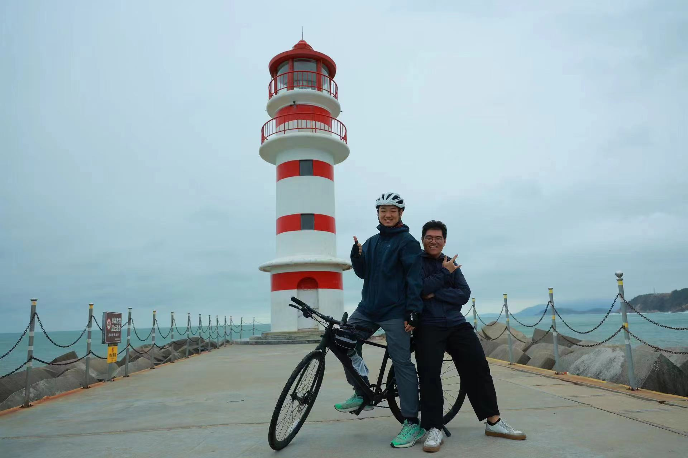
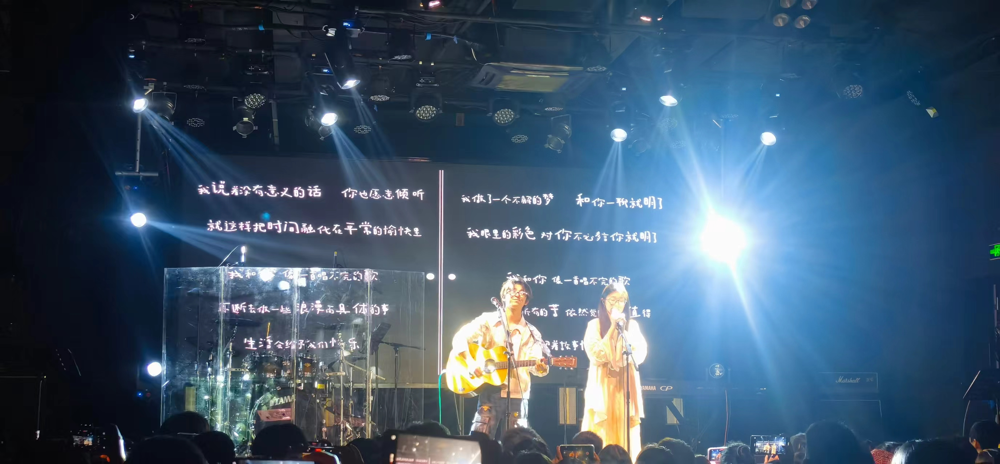

欢迎来到我的个人主页！这里将为您介绍一些我热爱的活动和爱好。

# 骑行
喜欢在路上的感觉。自由自在的骑行，想走就走，想停就停。不在乎骑行的终点，在乎的是沿途的风景和欣赏风景的心情。和大部分骑行者一样，我既爱骑行也爱拍照，想用图片记录自己的青春，希望老了以后翻看相簿，可以有满满的回忆。骑行后将图片上传到这个网站上，既是为了分享旅途时的心情，更是想告诉朋友们：我翻越了雪山，徜徉了原始森林，同时也超越了自我，请为我高兴。

一点趣事“路上，碰到一个强壮的骑行大佬，座驾是专业的公路车。虽然超了几次，也看他笃悠悠的拍照、欣赏风景，最终还是只能远眺他先到了神州半岛。人生大约也是如此，座驾还是很重要的。有句话：我花了这么多年、才能陪你喝咖啡。但是至少、在他休息的时候，我依然在骑行，才有远眺他先触达终点的资格。最终都到了，只是时间早晚而已。哪怕只能望着你的背影、一路上更加艰辛。骑行和跑步，都是遇见最美的自己的过程。”
 


# 音乐
在傍晚的暖阳下，我喜欢漫步在街头，带上耳机，沉浸在歌声中，享受着独处的片刻。我喜欢的歌以中文歌为主，还有英文民谣和日文民谣。我喜欢的歌手和乐队很多，最喜欢的伍佰的深情魅力，周杰伦的音乐天才，粥粥和小伙的纯粹与真诚，房东的猫的温暖与质朴，李宗盛的沉静与深沉，每一位都是我心中都很重要。

 
 


# 旅行
去看日月星辰，山川湖海，去看时间万象，人生百态.
2024，我永远在路上


# 摄影（记录生活）


这只是我生活中一小部分的爱好，希望您在浏览我的个人主页时能更多了解我！


<!--
## Header 2

> This is a blockquote following a header.
>
> When something is important enough, you do it even if the odds are not in your favor.

### Header 3

```js
// Javascript code with syntax highlighting.
var fun = function lang(l) {
  dateformat.i18n = require('./lang/' + l)
  return true;
}
```

```ruby
# Ruby code with syntax highlighting
GitHubPages::Dependencies.gems.each do |gem, version|
  s.add_dependency(gem, "= #{version}")
end
```

#### Header 4

*   This is an unordered list following a header.
*   This is an unordered list following a header.
*   This is an unordered list following a header.

##### Header 5

1.  This is an ordered list following a header.
2.  This is an ordered list following a header.
3.  This is an ordered list following a header.

###### Header 6

| head1        | head two          | three |
|:-------------|:------------------|:------|
| ok           | good swedish fish | nice  |
| out of stock | good and plenty   | nice  |
| ok           | good `oreos`      | hmm   |
| ok           | good `zoute` drop | yumm  |

### There's a horizontal rule below this.

* * *

### Here is an unordered list:

*   Item foo
*   Item bar
*   Item baz
*   Item zip

### And an ordered list:

1.  Item one
1.  Item two
1.  Item three
1.  Item four

### And a nested list:

- level 1 item
  - level 2 item
  - level 2 item
    - level 3 item
    - level 3 item
- level 1 item
  - level 2 item
  - level 2 item
  - level 2 item
- level 1 item
  - level 2 item
  - level 2 item
- level 1 item

### Small image


### Large image


### Definition lists can be used with HTML syntax.

<dl>
<dt>Name</dt>
<dd>Godzilla</dd>
<dt>Born</dt>
<dd>1952</dd>
<dt>Birthplace</dt>
<dd>Japan</dd>
<dt>Color</dt>
<dd>Green</dd>
</dl>

```
Long, single-line code blocks should not wrap. They should horizontally scroll if they are too long. This line should be long enough to demonstrate this.
```

```
The final element.
```-->
