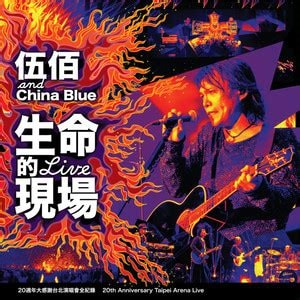
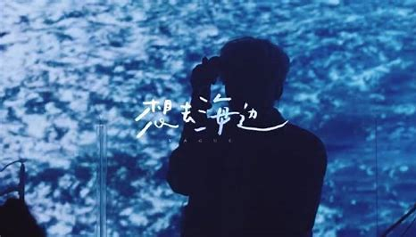

欢迎来到我的个人主页！这里将为您介绍一些我热爱的活动和爱好。

# 骑行
喜欢在路上的感觉。自由自在的骑行，不在乎骑行的终点。


 


# 音乐
我喜欢的歌以中文歌为主，还有英文民谣和日文民谣。我喜欢的歌手和乐队很多，最喜欢伍佰，周杰伦，粥粥和小伙，房东的猫，李宗盛，棱镜/夏日入侵企画。

 
 


# 旅行
喜欢旅行，感受一个城市特别的魅力

 
 


# 摄影（记录生活）
我喜欢在路上遇到好的风景的时候记录下来。

 
 


# 话剧（互动式）
喜欢线下看互动式沉浸式话剧和脱口秀，体验感拉满。

 
 


# 收藏句子
### 在行中知，在知中行，知行合一
### 人生是用来体验的，不是用来演绎完美的
### 是微风，是晚霞，是心跳，是无可替代
### 每逢大事有静气，不信今时无古贤。
### 永远潇洒自由自我
### 两列水波相遇后彼此穿过，仍然保持各自的运动特征，继续传播，就像没有跟另一列水波相遇一样。
### 等式两边是对同一观点的不同看法
### 艺术家的生活，科学家的工作
### Science aims to discover facts, but leaves us free to choose our own values.
### 此解只应天上有，人间能得几回闻
### 迎着风，迎向远方的天空
### 昔年曾见此湖图，不信人间有此湖。今日打从湖上过，画工还欠费功夫！
### 但是，当初课堂上听到种种奇妙结论时的惊喜，理解种种精妙证明后的沉醉，永远不会忘掉。我常常感叹，本科四年，我就站在数学殿堂的门槛上，朝里头看了几眼，见识到了许多人一辈子想都想不到的种种壮阔绚烂的奇景，足矣。只恨自己脚力不足，未能登堂入室，只有羡慕那些脚力好的同学，因为我知道，那深处的瑰丽，也同样是我想都想不到，理解都理解不了的。花有重开日，人无再少年。既入门来，就是有缘。毕业以后有一辈子的时间去操心现实世界的问题，但要再有这么好的机会可以饱览纯粹理性世界中往圣先贤构筑的高峰，可以有师长答疑解惑，可以和那么聪明的同学一起砥砺琢磨，千难万难。
### 往日欢歌如梦，转身万水千山
### 那些明亮的人，如果与你相遇，你是否有与之匹配的力量
### 年年有风，风吹年年，慢慢即漫漫。
### 我们学习知识，是为了追寻它背后的智慧。在知识爆炸的今天，每个人都有一定的知识焦虑感。可是我们的生命是有限的，不可能追逐无限的知识。
### 大家都喜欢盲从，好像世界上最安全的事，就是让自己消失在“多数”之中
### 你只要尝试过飞，日后走路时也会仰望星空，因为那是你曾到过，并渴望回去的地方
### 忠于理想，永远在路上，永远热泪盈眶
### “这个世界上最让奋斗者欣慰的是知道自己想做的事情被曾经和自己差不多的人做过并且做到过。
### “我喜欢将暮未暮的原野，一切颜色都已沉静，而黑暗尚未降临；我也喜欢将暮未暮的人生，所有的故事都已定型，而结局尚未来临。”
### 往哪走，都是往前走
### 兵者诡道，奇谋百出
### 胸有激雷而面如平湖者，可拜上将军。
### 但是太阳，他每时每刻都是太阳也都是旭日。当他熄灭着走下山去收尽苍凉残照之际，正是他在另一面燃烧着爬上山巅布散烈烈朝晖之时。有一天，我也将沉静着走下山去，扶着我的拐杖。那一天，在某一处山洼里，势必会跑上来一个欢蹦的孩子，抱着他的玩具。当然，那不是我。但是，那不是我吗？宇宙以其不息的欲望将一个歌舞炼为永恒。这欲望有怎样一个人间的姓名，大可忽略不计。


### 如果没人与你提及与提点，全靠你自己硬闯，那么，随便一个沟沟坎坎，都有可能是困死你一辈子的漩涡。

### 比起拥有，人总是在最接近幸福的时候幸福
### 旅游是平淡生活里的越狱，回忆起感觉很美好
### 简洁且巧妙的数学定理固然是很美的，但它的出现也代表着这个方向要走到尽头了。故事最美的时候不就是它结束的时候吗？
### 我想变成蚂蚁，我们像蚂蚁一样渺小，这片草地它要用一生去探索，我们觉着非常非常平常的草地，但是对它而言确神秘莫测，我们也有自己要探索的领地，虽然也许对别人而言稀疏平常 。生活在草坪上蚂蚁，能欣赏到一片美景的野花吗，欣赏不到因为这超越他的视野。蚂蚁虽然看不到超越它的美，但这片美是客观存在的，我们也像蚂蚁一样生活在有限的世界，但在我们的视野以外，也许还有更多更美神奇的存在


这只是我生活中一小部分的爱好，希望您在浏览我的个人主页时能更多了解我！


<!--
## Header 2

> This is a blockquote following a header.
>
> When something is important enough, you do it even if the odds are not in your favor.

### Header 3

```js
// Javascript code with syntax highlighting.
var fun = function lang(l) {
  dateformat.i18n = require('./lang/' + l)
  return true;
}
```

```ruby
# Ruby code with syntax highlighting
GitHubPages::Dependencies.gems.each do |gem, version|
  s.add_dependency(gem, "= #{version}")
end
```

#### Header 4

*   This is an unordered list following a header.
*   This is an unordered list following a header.
*   This is an unordered list following a header.

##### Header 5

1.  This is an ordered list following a header.
2.  This is an ordered list following a header.
3.  This is an ordered list following a header.

###### Header 6

| head1        | head two          | three |
|:-------------|:------------------|:------|
| ok           | good swedish fish | nice  |
| out of stock | good and plenty   | nice  |
| ok           | good `oreos`      | hmm   |
| ok           | good `zoute` drop | yumm  |

### There's a horizontal rule below this.

* * *

### Here is an unordered list:

*   Item foo
*   Item bar
*   Item baz
*   Item zip

### And an ordered list:

1.  Item one
1.  Item two
1.  Item three
1.  Item four

### And a nested list:

- level 1 item
  - level 2 item
  - level 2 item
    - level 3 item
    - level 3 item
- level 1 item
  - level 2 item
  - level 2 item
  - level 2 item
- level 1 item
  - level 2 item
  - level 2 item
- level 1 item

### Small image


### Large image


### Definition lists can be used with HTML syntax.

<dl>
<dt>Name</dt>
<dd>Godzilla</dd>
<dt>Born</dt>
<dd>1952</dd>
<dt>Birthplace</dt>
<dd>Japan</dd>
<dt>Color</dt>
<dd>Green</dd>
</dl>

```
Long, single-line code blocks should not wrap. They should horizontally scroll if they are too long. This line should be long enough to demonstrate this.
```

```
The final element.
```-->
